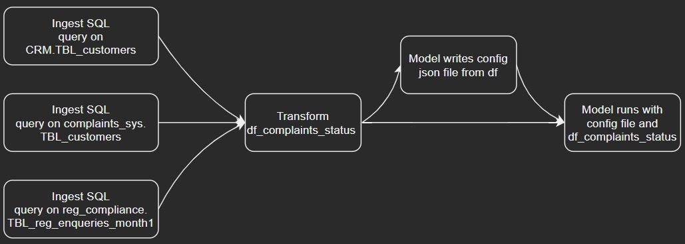
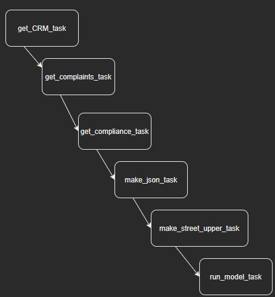

# __Introduction to Apache Airflow__

Apache Airflow, or just Airflow, is _"a platform to programmatically author, schedule and monitor workflows."_

Airflow was created in October 2014 by Airbnb. It is now being maintained by the Apache Software Foundation, home to Spark, Hive, Hadoop and Kafka, just to name a few.

From wiki: _"Airflow is written in Python, and workflows are created via Python scripts. Airflow is designed under the principle of 'configuration as code' . . . Python allows developers to import libraries and classes to help them create their workflows."_

Documentation: https://airflow.apache.org/docs/

## __Why Airflow?__

There are many use-cases for Airflow for the development and maintenance of models. A good place to start is the abstracted model workflow. Roughly, this workflow follows the below:

1. Receive configuration
2. Initialize model, based on configuration
3. Ingest data selected by configuration
4. Run model, with initialized model and ingested data
5. Produce output, based on configuration (either aggregated or transformed granular data for upstream use-cases)

This simplified workflow ommits many steps common to models, like data cleaning at ingestion, which should be handled seperately. It also ommits the many dependencies that the model may perform after model run, example Post Model Adjustments.

Airflow is created to schedule these to run with __chained dependencies__ or __mixed dependencies__ that allow for complex workflows like the one described above. It allows control of these workflows through schedules, sensors and triggers. There are a number of interfaces for Airflow a user-friendly UI, native services in GCP:Cloud Composer, AWS:Managed Workflows for Apache Airflow(MWAA) and Azure(requires config) and a Command Line Interface as well.

All of this allows for the utmost control and monitoring of your workflows, programmatically and with unparralleled feedback.

## __How does Airflow work?__

The best way to illustrate Airflow is to go through a very simple workflow and translate it to Airflow. This introduces the basic components within Airflow. 

### __Overview of workflow__



This is a visual representation of tasks that are being completed to output a Pandas dataframe named `df_complaints_status`. Starting from left to right we see that we have three tasks in parallel that need to run before a central dataframe combines all three. Following on, a json config file is written based on criteria from the dataframe. The model then runs with both the config file and the df_complaints_status file.

### __1. Directed Acyclic Graphs__

A 'workflow' is structured by Airflow as a Directed Acyclic Graph or DAG. It represents a set of tasks, agnostic to program language, that make up your workflow including the dependencies between them. DAGs are written in Python.

Our first step is to import the airflow library and instantiate the DAG.

```python
from airflow.models import DAG
from datetime import datetime

default_args = {
    'owner':'nliakas',
    'email':'nliakas@dataplace.com'
    'start_date':datetime(2022,2,21) # This is the earliest date to run DAG
}

# From airflow.models we created an DAG-object and stored it in the variable 'model_dag'
# Using crontab you can specify a schedule. Here is every month at 00:00 
model_dag = DAG('model_workflow', default_args=default_args, schedule='0 0 1 * *')
```
### __2. Ingestion Tasks__

A 'task' is a specified term in Airflow. It is an instantiation of Airflow Operators. Operators are subclasses that allow Airflow to interact with a number of different program languages(ex. PythonOperator, BashOperator, PostgresOperator). They take in arguments that configure this interaction and are instantiated as tasks that are represented by variables.

In this step we will create the ingestion tasks of three SQL runs using SQLalchemy, but we could have used Airflows built-in Operators for the specific SQL dialects we are needing to connect to.

```python
from sqlalchemy import create engine
import pandas as pd

from airflow.operators.python_operator import PythonOperator

df_complaints_status = pd.DataFrame()

def SQL_to_df(str_arg, database_name):
    engine = create_engine('postgresql://user@localhost:5432/{}'.format(database_name))
    conn = engine.connect()

    SQL_df = pd.read_sql('SELECT * from {}'.format(str_arg), conn)

    df_complaints_status = df_complaints_status.append(SQL_df, ignore_index=True)

# Create three tasks with the Python Operator with the above function to create three pandas frames from the different databases
# The function above is used as the Python executable

get_CRM_task = PythonOperator(
                    task_id='get_CRM_task',
                    python_callable=SQL_to_df,
                    op_args=['CRM.TBL_customers','CRM']
                    dag=model_dag
                            )

get_complaints_task = PythonOperator(
                    task_id='get_complaints_task',
                    python_callable=SQL_to_df,
                    op_args=['complaints_sys.TBL_customers','complaints_sys']
                    dag=model_dag
                            )

get_compliance_task = PythonOperator(
                    task_id='get_compliance_task',
                    python_callable=SQL_to_df,
                    op_args=['reg_compliance.TBL_reg_enquiries_month1','reg_compliance']
                    dag=model_dag
                            )
```
### __3. Transforming and Model Run__

We now have a `df_complaints_status` from our ingestion and we need to transform it. 

1. So we create a transform task with the `PythonOperator` and using a function that capitalises the `street_name` field.

2. Then we will create a `model_json` that will take in the field names and enumerate them. 

3. The model will then take as arguments the transformed `df_complaints_status` and the `model_json` and run the model.

```python

def capitalize():
    df_complaints_status['upper_street_name'] = map(lambda x: x.upper(), df_complaints_status['street_name'])

import json 
make_street_upper_task = PythonOperator(
                    task_id='make_street_upper_task',
                    python_callable=capitalize,
                    dag=model_dag
                            )

# makes a json out of the columns from a pandas dataframe to configure model
def make_json():
    json_dict = {c: i for i, c in enumerate(df_complaints_status.columns)}
    json_config = json.dumps(json_dict, indent=2)

make_json_task = PythonOperator(
                    task_id='make_json_task',
                    python_callable=make_json,
                    dag=model_dag
                            )

# This operator will take the args and run them with the imported method that was locally stored in the repo

from model_package import model_run

run_model_task = PythonOperator(
                    task_id='run_model_task',
                    python_callable=model_run,
                    op_args=[json_config,df_complaints_status]
                    dag=model_dag
                            )
```

### __4. Combining__

Airflow creates dependencies between tasks via Bitshift operators:
* `>>` - This means the task on the left is performed before the task on the right
* `<<` - This means the task on the right is performed before the task on the left

At the bottom of the python file where the DAG is saved as ___model-dag.py___, is where it is customary to make dependencies between explicit.
Int he following code-snippit we will combine the above into the DAG with dependencies.

```python
from airflow.models import DAG
from airflow.operators.python_operator import PythonOperator

from sqlalchemy import create engine
import pandas as pd
import json
from datetime import datetime

# Our custom model_package class - we import the model_run method.
from model_package import model_run

# Instantiate the DAG
default_args = {
    'owner':'nliakas',
    'email':'nliakas@dataplace.com'
    'start_date':datetime(2022,2,21) # This is the earliest date to run DAG
}

# From airflow.models we created an DAG-object and stored it in the variable 'model_dag' 
model_dag = DAG('model_workflow', default_args=default_args)

# create DataFrame for DAG
df_complaints_status = pd.DataFrame()

def SQL_to_df(str_arg, database_name):
    engine = create_engine('postgresql://user@localhost:5432/{}'.format(database_name))
    conn = engine.connect()

    SQL_df = pd.read_sql('SELECT * from {}'.format(str_arg), conn)

    df_complaints_status = df_complaints_status.append(SQL_df, ignore_index=True)

def capitalize():
    df_complaints_status['upper_street_name'] = map(lambda x: x.upper(), df_complaints_status['street_name'])

# makes a json out of the columns from a pandas dataframe to configure model
def make_json():
    json_dict = {c: i for i, c in enumerate(df_complaints_status.columns)}
    json_config = json.dumps(json_dict, indent=2)

# Create three tasks with the Python Operator with the above function to create three pandas frames from the different databases
# The function above is used as the Python executable

get_CRM_task = PythonOperator(
                    task_id='get_CRM_task',
                    python_callable=SQL_to_df,
                    op_args=['CRM.TBL_customers','CRM']
                    dag=model_dag
                            )

get_complaints_task = PythonOperator(
                    task_id='get_complaints_task',
                    python_callable=SQL_to_df,
                    op_args=['complaints_sys.TBL_customers','complaints_sys']
                    dag=model_dag
                            )

get_compliance_task = PythonOperator(
                    task_id='get_compliance_task',
                    python_callable=SQL_to_df,
                    op_args=['reg_compliance.TBL_reg_enquiries_month1','reg_compliance']
                    dag=model_dag
                            )

make_street_upper_task = PythonOperator(
                    task_id='make_street_upper_task',
                    python_callable=capitalize,
                    dag=model_dag
                            )
make_json_task = PythonOperator(
                    task_id='make_json_task',
                    python_callable=make_json,
                    dag=model_dag
                            )

# This operator will take the args and run them with the imported method that was locally stored in the repo
run_model_task = PythonOperator(
                    task_id='run_model_task',
                    python_callable=model_run,
                    op_args=[json_config,df_complaints_status]
                    dag=model_dag
                            )

# Our DAG will run in this order with each task waiting for the execution, but not the completion, of the previous to run.
get_CRM_task >> get_complaints_task>> get_compliance_task >> make_street_upper_task >> make_json_task >>run_model_task

```

## Interfacing with DAG

A visual representation of this transformed DAG is here:



The DAG UI is one way that is easy to use for monitoring and controlling DAGs. Below is an example.


